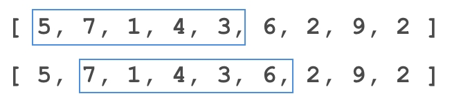

# Sliding windows



* Два указателя
* Если нет необходимости проходить вложенный цикл каждый раз полностью
* Улучшает сложность с O(n2) -> O(n)

1. Указатели движутся в одну сторону
   * Найти максимальный/минимальный “хороший” участок
   * Найти количество “хороших” участков
   * Найти все анаграммы в строке
   * Обработать массив в один проход - например удалить все нули
2. Указатели движутся навстречу друг другу
   * Полиндром
3. Два указателя в разных массивах
   * слияние отсортированных массивов


```clike
int l = 0, r = 0;

while (r < n) {
    while (г < n && !«хороший») { 
        добавить a[r];
        r++;
    }

    while (!«плохой») {
        убрать a[l];
        l++;
    }
}
```

```java
int r = 0;

for (int l=0; l < n; l++) {
    while (г < n && !«хороший») { 
        добавить a[r];
        r++;
    }
    
    убрать a[l];
}
```

```java
int l = 0;

for (int r=0; r < n; r++) {
    добавить a[r];
    
    while (!«плохой») {
        убрать a[l];
        l++;
    }
}
```

