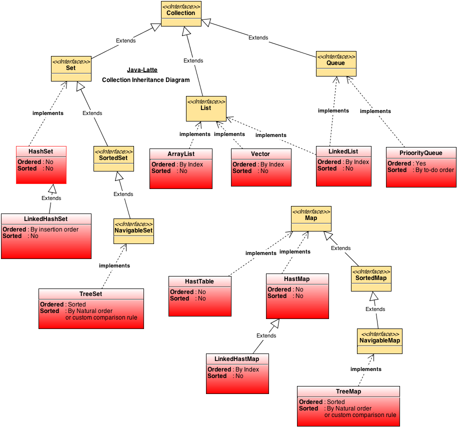

# Collections

.png>)

* HashTable - хэш-таблица, не позволяет null в качестве ключа, все методы synchronized (низкая производительность)
* [HashMap](https://www.evernote.com/shard/s696/nl/1/69e6f898-b0dd-441e-b501-6dd915345a5c?title=HashMap)
* LinkedHashMap - упорядоченная мапа, основанная на двухсвязном списке
* TreeMap - упорядоченная мапа основанная на красно-черном дереве
* WeakHashMap - мапа с слабыми ссылками, gc удалит объекты если на них не будет других ссылок.
* HashSet - внутри объект hashMap для хранения, элементы хранятся на месте ключа, а на место значения ложится new Object()
* LinkedHashSet - использует LinkedHashMap для хранения, гарантирует порядок для вставки.
* TreeSet - использует NavigableMap, поддерживает порядок при помощи Comparator
