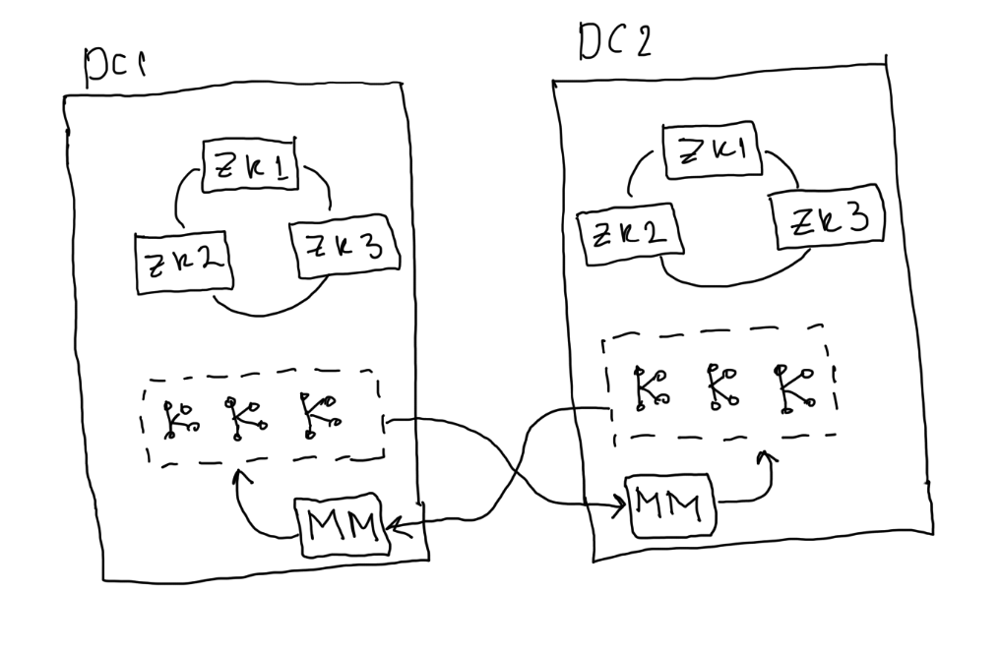

# Kafka cluster scheme

.png>)

### 3 data centers

.png>)

* rack.id=\<location>
* replica.selector.class= \<ReplicaSelector impl>
* Out of the box:
  * LeaderSelector (default)
  * RackAwareReplicaSelector

### 2 data centers

.png>)

* If dc1 goes down zookeeper wouldn't keep the quorum consensus.
* Outage.

.png>)

* Hierarchical zookeeper quorum.
* Brokers configured to talk with local zk's.
* Availability over consistency.
* Clients lose visibility of partition leaders in other DC
* Production either partially continues or blocks, depending on replication settings
* Manual intervention required to resume processing

<figure><figcaption></figcaption></figure>

.png>)

* ZooKeeper behavior is same as 3DC setup.
* Replication tradeoffs are the same as 2DC setup.

Mirroring clusters

