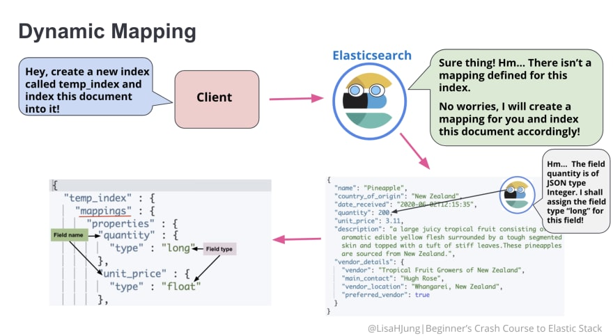

# Elastic

* document store and index data
* distributed search and analytics engine


inverted index - every unique word and documents where it occurs in.

<figure><figcaption></figcaption></figure>


```
POST temp_index/_doc
{
  "name": "Pineapple",
  "botanical_name": "Ananas comosus",
  "produce_type": "Fruit",
  "country_of_origin": "New Zealand",
  "date_purchased": "2020-06-02T12:15:35",
  "quantity": 200,
  "unit_price": 3.11,
  "description": "a large juicy tropical fruit consisting of aromatic edible yellow flesh surrounded by a tough segmented skin and topped with a tuft of stiff leaves.These pineapples are sourced from New Zealand.",
  "vendor_details": {
    "vendor": "Tropical Fruit Growers of New Zealand",
    "main_contact": "Hugh Rose",
    "vendor_location": "Whangarei, New Zealand",
    "preferred_vendor": true
  }
}
```

<figure><figcaption></figcaption></figure>

mappings - defining how fields are stored and indexed

<figure><figcaption></figcaption></figure>

```
GET temp_index/_mapping
```

[https://www.elastic.co/guide/en/elasticsearch/reference/current/mapping-types.html](https://www.elastic.co/guide/en/elasticsearch/reference/current/mapping-types.html)


