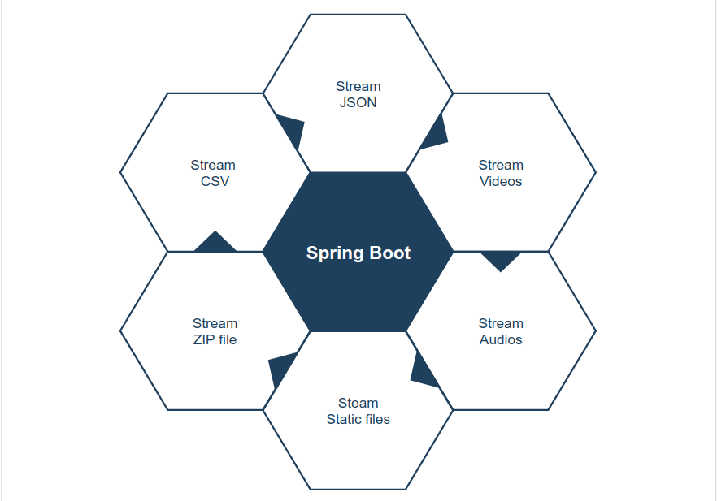

# Spring MVC Streaming and SSE

Дока&#x20;












* _ResponseBodyEmitter -_ **handles async responses.** writes output message through HttpMessageConverter
* _SseEmitter -_ **is actually a subclass of **_**ResponseBodyEmitter**_** and provides additional **_**Server-Sent Event**_** (SSE)** support out-of-the-box. На клиенте нужна sse библиотека
* _StreamingResponseBody -_ **to write directly to an **_**OutputStream**_** before passing that written information back to the client using a **_**ResponseEntity.**_
* _Spring WebFlux_ - works similar to Spring MVC. supports fully non blocking reactive streams. provides streaming data, without providing any additional configuration.


Асинхронно (non blocking operation) означает, что ResponseEntity\<StreamingResponseBody> будет отдан немедленно

Клиент держит коннект alive и получает данные из стрима и подтверждает закрытие стрима

Сontent can be written directly to the response _OutputStream_ without holding up the threads in the servlet container.

This means that the download process will start immediately on the client, while the server is processing and writing data in chunks.

It is highly recommended to configure `TaskExecutor` for executing asynchronous requests. `TaskExecutor` is an interface that abstracts the execution of a Runnable.


`StreamingResponseBody` is an interface with only one method:

```
void writeTo(OutputStream outputStream)
      throws IOException
```


_StreamingResponseBody timeout_ should be increased if you are returning a huge stream and your application throws a timeout exception.

```
spring.mvc.async.request-timeout = 3600000
```


```java
package com.techshard.download.controller;

import org.slf4j.Logger;
import org.slf4j.LoggerFactory;
import org.springframework.http.HttpStatus;
import org.springframework.http.MediaType;
import org.springframework.http.ResponseEntity;
import org.springframework.web.bind.annotation.GetMapping;
import org.springframework.web.bind.annotation.RequestMapping;
import org.springframework.web.bind.annotation.RestController;
import org.springframework.web.servlet.mvc.method.annotation.StreamingResponseBody;

import javax.servlet.http.HttpServletResponse;
import java.io.*;
import java.util.zip.ZipEntry;
import java.util.zip.ZipOutputStream;

@RestController
@RequestMapping ("/api")
public class DownloadController {

    private final Logger logger = LoggerFactory.getLogger(DownloadController.class);

    @GetMapping (value = "/download", produces = MediaType.APPLICATION_JSON_VALUE)
    public ResponseEntity<StreamingResponseBody> download(final HttpServletResponse response) {

        response.setContentType("application/zip");
        response.setHeader(
                "Content-Disposition",
                "attachment;filename=sample.zip");

        StreamingResponseBody stream = out -> {

            final String home = System.getProperty("user.home");
            final File directory = new File(home + File.separator + "Documents" + File.separator + "sample");
            final ZipOutputStream zipOut = new ZipOutputStream(response.getOutputStream());

            if(directory.exists() && directory.isDirectory()) {
                try {
                    for (final File file : directory.listFiles()) {
                        final InputStream inputStream=new FileInputStream(file);
                        final ZipEntry zipEntry=new ZipEntry(file.getName());
                        zipOut.putNextEntry(zipEntry);
                        byte[] bytes=new byte[1024];
                        int length;
                        while ((length=inputStream.read(bytes)) >= 0) {
                            zipOut.write(bytes, 0, length);
                        }
                        inputStream.close();
                    }
                    zipOut.close();
                } catch (final IOException e) {
                    logger.error("Exception while reading and streaming data {} ", e);
                }
            }
        };
        logger.info("steaming response {} ", stream);
        return new ResponseEntity(stream, HttpStatus.OK);
    }
}

```

In this API endpoint, we are reading multiple files from a directory and creating a zip file. We are executing this process within StreamingResponseBody_._ It writes data directly to an OutputStream before passing that written information back to the client using a ResponseEntity.
